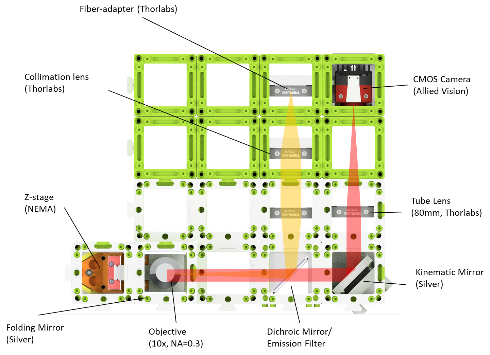

# Democratizing Labautomation using UC2, Opentrons, OpenFlexure and ImJoy

An simple open-source approach to bring automated liquid handling and high throughput microscopy to your lab.

---

## Preprint

The preprint for the *Hi2*  accompanied with a series of applications ca be found on [**BIORXIV**]() 😊

## High-throughput for UC2: ***Hi2***

This project features:

```
- Large-scale well plate scanning microscope (standalone, UC2-based)
- Open imaging platform for high-throughput experiments
- GRBL-based motor and Laser controler
- OpenFlexure Server-based GUI and control software
- ImJoy-based image processing system (with ImageJ.js)
- Sample protocols to control the OFM microscope with ImJoy and Opentrons
- Long-term experiments with small deviations of the FOV
- Autofocus, scanning, fluorescence microscopy
- costs <1000€ (for single-wavelength imaging)
```

In the manuscript we present two different setups. A dedicated github repository for the self-contained XYZt scanning microscope for the Opentrons (i.e. ***OpenMicroTrons***) can be found [here](https://github.com/beniroquai/Opentrons-Microscope-Platereader).

Below you will find in-depth explanation for the Hi2 openUC2-based well-scanning microscope.
***IMPORTANT:*** More information can be found in our [UC2-Hi2 repository](https://github.com/openUC2/UC2-Hi2).

<p align="center">

</p>


# Quickstart

You are keen on starting your own automated workflow? You can have a look in the [Jupyter Notebooks](https://github.com/openUC2/UC2-Hi2/tree/master/JUPYTER) which give you an idea how such a workflow may look like. These Notebooks run on the Raspberry Pi inside the Opentrons and handle:

* Pipetting commands using the Opentrons OT2
* microscopic imaging using the Openflexure Server and the openUC2 Microscope
* Image Processing using the ImJoy Plugin environemnt

It requires a number of steps to setup everything. Below we hope to give you some guidance to get this working.

A rough schematic of how the different components interact with each other is illustrated in the figure below:

<p align="center">

</p>


## Subsystem: OpenFlexure Server

[SRC](https://openflexure.org/projects/microscope/develop)
<p align="center">

</p>


# Hardware

## Subsystem: Hi2 - UC2 High-Throughput Microscope

The two new components for the openUC2 framework which were developed for the already existing modular optical toolkit are the high-throughput XY-stage and the rapidly scanning z-stage. Both stage types are based on CNC components, here the XY stage is in large part derived from a commercially avaialbe laser engraver (Neje Master Mini 2). The Z-stage relies on a NEMA11 motor and a MGN12H linear bearing mechanism combined with a magnetic-bearing mechanism to realiz wobble-reduced motion along the Z-axis.

<p align="center">

</p>

## Electronics and Code

We rely on a commercially available open-source CNC/3D printing board [Makerbase mks DLC](https://github.com/makerbase-mks/MKS-DLC), which can control the LED, the Laser using PWM and all steppers using the [GRBL](https://github.com/grbl/grbl) firmware. All commands are delivered using G-Code. In order to use the microscope, one simply needs to flash the GRBL softwrae on the MKS board using the Arduino IDE.


## Optical setup

The UC2-based microscope relies on a wide-field fluorescence microscope, where a fiber-coupled laser diode provides a suitable excitation field for AF647 dyes. The objective lens can easily be moved using the NEMA motor driven Z-stage

<p align="center">

</p>


### Bill of Material (BOM)

Along with the 3D printed parts in the Github-repository, you need a set of mechanical, electrical and optical parts summarized in the BOM below:

***Dead Link?***: Ebay is not really a reliable source since resellers may discontinue the product. In case you're looking for a component which can not be found, file an issue [here](https://github.com/beniroquai/dSTORM-on-a-Chi-ea-p/) - alternatively: Copy the name under "Details" and search for it in Ebay. (E.g. "3450 300mW 637nm Dot Laser Module TTL/analog 12VDC" site:laserlands.net) Good luck 🍀

Amazon is more reliable, but personally we try to avoid ordering there (Sorry..). We try to update the list with Amazon links

For the whole system to work you will need the following UC2 modules which you can get from our website:


|  Quantity | Details  |  Price (per piece)|
|---|---|---|
|1x| MKS DLC 2.0  CNC Shield + Stepper Controlers + 12V Powersupply + USB Cable| 30 € |
|2x |[45° Thorlabs Mirror Cube](https://github.com/bionanoimaging/UC2-GIT/tree/master/CAD/ASSEMBLY_CUBE_Mirror_45_Thorlabs)| 60€ |
|1x |[Z-stage Cube with NEMA Motor](https://github.com/bionanoimaging/UC2-GIT/tree/master/CAD/ASSEMBLY_CUBE_Z-STAGE_NEMA_MGN)| ~50€ |
|4x |[Thorlabs Cage Cube](https://github.com/bionanoimaging/UC2-GIT/tree/master/CAD/ASSEMBLY_CUBE_Thorlabs)|  30€ |
|1x |[Allied Vision Cube](https://github.com/bionanoimaging/UC2-GIT/tree/master/CAD/ASSEMBLY_CUBE_AlliedVision_Alvium)|  350 €|
|8x |[Empty Cube (IM)](https://github.com/bionanoimaging/UC2-GIT/tree/master/CAD/ASSEMBLY_CUBE_Base)|  20 € |
|16 x |[Puzzle Base Plate ](https://github.com/bionanoimaging/UC2-GIT/tree/master/CAD/ASSEMBLY_Baseplate)| ~5€ |
|1 x |[Dichroic Mirror Cube ](https://github.com/bionanoimaging/UC2-GIT/tree/master/CAD/ASSEMBLY_CUBE_Dichroic_Beamsplitter)| ~50€ |
|1x |[Hi2 Module](https://github.com/openUC2/UC2-Hi2)| 200€ |

As a laser we used a fiber-coupled 635nm laser from micos for around 80€ threaded into a Thorlabs cage.
As a dichroic mirror we use Comar IY740 + a suitable emission filter (number will follow!).

***ATTENTION:*** In case any parts are missing, please file an issue or contact us! We are happy to help out and to improve 😊

### Design-files

All design files for Autodesk Inventor 2019 Student Edition can be found in the [openUC2 Hi2 repository](https://github.com/openUC2/UC2-Hi2/tree/master/INVENTOR).

# Software

## Nvidia Jetson Nano

We will provide a ready-to-use SD-card image for quick-starting the OFM Server on the Nvidia Jetson. The process to install all the dependencies is quite lengthy, especially since one has to compile OpenCV for Python3.7 to get the Allied Vision Cameras to work.

***TODO:*** Add the jetson image to Zenodo

If you want to get it run on another machine or want to go through the process yourself, please find an in-depth documentation in the forked [OFM-Server repository](https://gitlab.com/beniroquai/openflexure-microscope-server/-/tree/opentrons-grbl)

Once it's installed, you can use git to always pull the latest version

## ImJoy

<p align="center">

</p>

Please refer to the comprehensive guid in the [ImJoy subpage](./imjoy.md)

## Opentrons OT2

<p align="center">

</p>

The Opentrons OT2 runs on a Raspberry Pi and hosts a number of ways to interact with it. The simplest one is to access it through its Jupyter Notebooks since it also provides a Terminal for installing external Python packages e.g.  

We suggest to copy/upload all the code in the folder [Jupyter Notebooks](https://github.com/openUC2/UC2-Hi2/tree/master/JUPYTER) to the opentrons Jupyter Server by simply uploading it in the browser.

For the code to properly run we need to install some packages through pip. Since the OT2 comes with a partially read-only file system which does not allow any compiling of additional libraries, we were very limited in the variety of the different libraries. Therefore we do all image processing through ImJoy for example. Libraries such as `matplotlib` or `pillow` are not installed.

In case of problems, it can help to install pip packages using
```py
pip install -u PACKAGENAME
```
to avoid any conflict with privileges. Installing packages can either be done with an active internet connection of by sideloading ZIP files from github repositoreis and unzipping them through the terminal. The path where the opentrons will upload them is in `/var/lib/Jupyter/Notebooks`. ***TODO:*** Check if this is valid!

The following packages are needed:
```
requesets
asyncio-python
asyncio-newest
imjoy-rpc
imjoy-jupyter-notebook
```

For a more comprehensive set of instructions can be found in the [ImJoy subpage](./imjoy.md).


## OpenFlexure Microscope (Server/GUI)

More information about the Openfelxure Microscope server can also be found on their webpage

Additiolly we give some more information about installing it on a Raspberry Pi and [here](https://github.com/beniroquai/Opentrons-Microscope-Platereader).

### Using ImJoy inside Opentrons' Jupyter Notebook

Therefore you can use the OFM Pyclient. Please have a look [here](https://gitlab.com/openflexure/openflexure-microscope-pyclient/-/blob/master/openflexure_microscope_client/microscope_client.py)


# Datasets

We provide many datasets in a publicly accessible repository. Please have a look at [ZENODO]() [***Comming Soon - need to wait for all data first***]

***Note:*** Not all the experiments are fully documented. If you need additional experimental parameters, please don't hesitate to get back to us so that we can add this!

# Tutorials
# Related projects

[iGEM Marburg 2019](https://github.com/igemsoftware2019/iGemMarburg2019/blob/fe84cfb141d7be023d2438a85184a40772899c5b/GUI/ColonyPickingGUI/ColonyPickerGUI.py)

# Contribute

If you have a question or found an error, please file an issue! We are happy to improve the device!  

# License

Please have a look into the dedicated [License file](LICENSE.MD).

# Disclaimer

We do not give any guarantee for the proposed setup. Please use it at your own risk. Keep in mind that Laser source can be very harmful to your eye and your environemnt!
