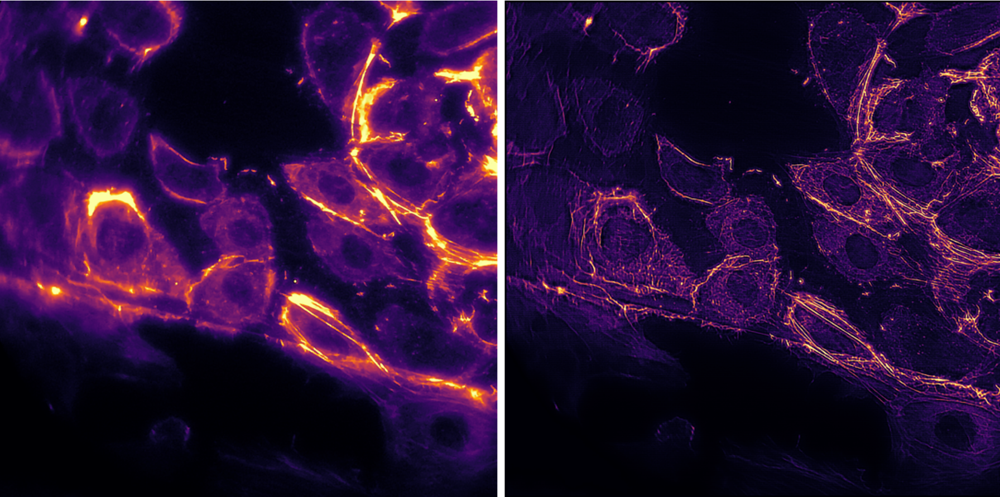
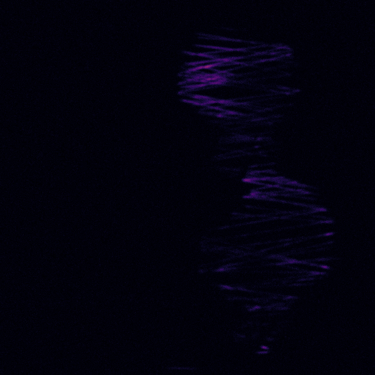

# cellSTORM 2 

---

## Abstract 

In microscopic imaging, where an optimum between high throughput, high resolution, small time-scales and low light exposure is of high interest, a high price tag and complex optical systems is usually inevitable. This is especially true for super-resolution (SR) methods like single molecule imaging techniques (e.g. dSTORM, PALM, DNA-Paint). Recent advances in waveguide-based imaging have opened new opportunities by separating the illumination- and detection-path by taking advantage of the evanescent field inside a high refractive index photonic waveguide which excites fluorescently labeled cells growing on its surface (i.e. TIRF). 
Combining this with recent advances of low cost and off-the-shelf components like cellphone cameras, entertainment lasers and optical-pickups (OPU), we built the first 3D printed microscope which can perform dSTORM measurements for an overall price of <1000€ fitting on the palm of hand. Using fluctuation-based SR methods like ESI or MUSCAL, this device can also perform inexpensive TIRF experiments in living environments (i.e. incubator). We show dSTORM results of fixed HeLa and HUVEC cells labeled with Alexa Fluo 647® to give a proof-of-principle for a change in paradigm – science for a dime. 
With a lateral resolution of about 100nm, an axial sectioning of 150nm and a FOV of 400x400µm2 this device gives a new tool to biologists to study cell dynamics on the cheap. All sources and design files are shared in an online repository to attempt democratization in scientific research and make cutting-edge research not only available but also affordable. 
Additionally we show the recent advances in the open-source toolbox UC2 which not only is good for out-reach activities in STEM-research but paving the way to democratize super-resolution microscopy. 
<p align="center">

</p>

## CAD Designs 

If you want to replicate the device, you can find a detailed description with all necessary parts to order in this repsitory:

[CAD-Repository](https://github.com/beniroquai/dSTORM-on-a-Chi-ea-p/tree/master/CAD)


## Android APP: STORM-Controler 


To control the Lens or Laser using a customized MQTT controler APP, you can visit this repository:

[APP: SOTRM-Controler](https://github.com/beniroquai/dSTORM-on-a-Chi-ea-p/tree/master/ANDROID/STORM-Controller)


## Learn2Fluct

The python and tensorflow-based neural network to use "SOFI"-like image reconstruction based on ```convLSTM2D``` layers on a cellphone can be found here:

[Neural Network](https://github.com/beniroquai/dSTORM-on-the-chea-i-p-Learn2Fluct)

It aims to transfer a stack of noisy low resolution images with varying illumination pattern: 

<p align="center">

</p>

into high resolution images:

<p align="center">

</p>


## Android APP: STORM-Imager

This is the APP which can record images, control the device and predict a super-resolved result form the camera live stream. The APP can be found here:

[APP: STORM-Imager](https://github.com/beniroquai/dSTORM-on-a-Chi-ea-p-ANDROID)

## Electronics and Code

To move the lenses or control the Laser intensity, we relied on Espressife EPS32s. The code to control them wirelessly using MQTT can be found here:

[APP: STORM-Imager](https://github.com/beniroquai/dSTORM-on-a-Chi-ea-p/tree/master/ESP32)

