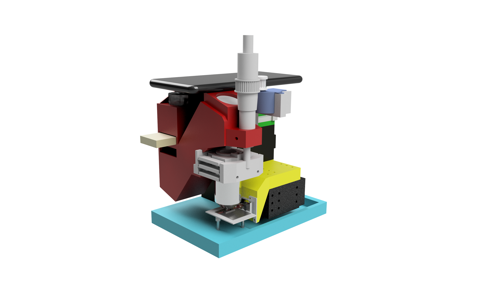
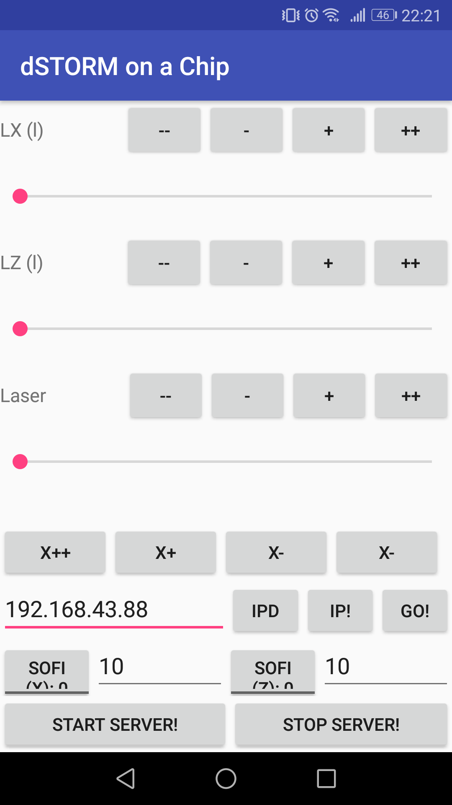
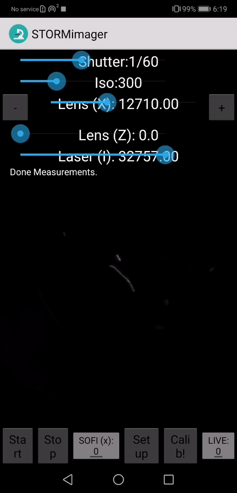

# cellSTORM 2

A low-cost superresolution imaging device based on a cellphone camera and photonic waveguide chips

---

## Abstract

In microscopic imaging, where an optimum between high throughput, high resolution, small time-scales and low light exposure is of high interest, a high price tag and complex optical systems is usually inevitable. This is especially true for super-resolution (SR) methods like single molecule imaging techniques (e.g. dSTORM, PALM, DNA-Paint). Recent advances in waveguide-based imaging have opened new opportunities by separating the illumination- and detection-path by taking advantage of the evanescent field inside a high refractive index photonic waveguide which excites fluorescently labeled cells growing on its surface (i.e. TIRF).
Combining this with recent advances of low cost and off-the-shelf components like cellphone cameras, entertainment lasers and optical-pickups (OPU), we built the first 3D printed microscope which can perform dSTORM measurements for an overall price of <1000€ fitting on the palm of hand. Using fluctuation-based SR methods like ESI or MUSCAL, this device can also perform inexpensive TIRF experiments in living environments (i.e. incubator). We show dSTORM results of fixed HeLa and HUVEC cells labeled with Alexa Fluo 647® to give a proof-of-principle for a change in paradigm – science for a dime.
With a lateral resolution of about 100nm, an axial sectioning of 150nm and a FOV of 400x400µm2 this device gives a new tool to biologists to study cell dynamics on the cheap. All sources and design files are shared in an online repository to attempt democratization in scientific research and make cutting-edge research not only available but also affordable.
Additionally we show the recent advances in the open-source toolbox UC2 which not only is good for out-reach activities in STEM-research but paving the way to democratize super-resolution microscopy.

## cellSTORM II

The compact device features:

```
- autofocus
- automatic coupling mechanism
- on-device superresolution imaging
- survives cell incubators for several days
- performs autonomous imaging over several days
- costs <1000€
- optical resolution down to 100nm
- multiple wavelength can be used (sequentially)
- using photonic waveguide chips TIRF is possible
```


<p align="center">

</p>


## Temporal superresolution imaging

Using SRRF from the Henrique lab it's possible to quickly increase the resolution even without complicated STORM protocols:

<p align="center">

</p>

## CAD Designs

If you want to replicate the device, you can find a detailed description with all necessary parts to order in this repsitory:

[CAD-Repository](https://github.com/beniroquai/dSTORM-on-a-Chi-ea-p/tree/master/CAD)

We now also have a pictures tutorial with a step-by-step guide on how to build the cellSTORM microscope [here](https://github.com/beniroquai/dSTORM-on-a-Chi-ea-p/tree/master/CAD#assembly)


## Android APP: STORM-Controler

To control the Lens or Laser using a customized MQTT controler APP, you can visit this repository:

[APP: STORM-Controler](https://github.com/beniroquai/dSTORM-on-a-Chi-ea-p/tree/master/ANDROID/STORM-Controller)

This app allows basic hardware controls:
<p align="center">

</p>

## Android APP: STORM-Imager

This is the APP which can record images, control the device and predict a super-resolved result form the camera live stream. The APP can be found here:

[APP: STORM-Imager](https://github.com/beniroquai/dSTORM-on-a-Chi-ea-p-ANDROID)


### Autofocus inside the APP:

It's just an example how the cellphone maintains the focus. This is done by maximizing the focus metric (i.e. standard deviation over z) as a function of the focus motor position.

<p align="center">

</p>


### SOFI-based superresolution imaging inside the APP:

This is an example of the SOFI-based superresolution imaging using the neural network mentioned below. We used fixed *e.coli* labelled with ATTO 647.
The fluctuation of the illumination is the result of the discrete mode pattern in the singlemode waveguide chip. The input field changes the intensity pattern.   

<p align="center">

</p>

## Android APP: FreeDCam (cellSTORM module)

For the *d*STORM experiments we used the open source APP [FreeDCam](https://github.com/beniroquai/FreeDcam/tree/cellstorm) originally developed and mainted by [killerink](https://github.com/KillerInk/FreeDcam). We provide a modified version for the Huawei P9 and P20 which is used in this work. It enables

1. fast read-out and saving of cropped RAW frames to the SD-cad
2. stream the RAW buffer to a c-server

To stream the data to a server [this manual](https://github.com/beniroquai/FreeDcam/tree/cellstorm/server_mac) gives some more detailed information. It requires Android Studio which compiles the c program into an executable. Inside the APP you need to select the IP of the server.

Many thanks to [@Killerink](https://github.com/KillerInk/) to make this work!


## Learn2Fluct

The python and tensorflow-based neural network to use "SOFI"-like image reconstruction based on ```convLSTM2D``` layers on a cellphone can be found here:

[Neural Network](https://github.com/beniroquai/dSTORM-on-the-chea-i-p-Learn2Fluct)

It aims to transfer a stack of noisy low resolution images with varying illumination pattern:

<p align="center">

</p>

into high resolution images:

<p align="center">

</p>

### Live-Demo

Please test this [link](./tfjs/index.html).

## Electronics and Code

To move the lenses or control the Laser intensity, we relied on Espressife EPS32s. The code to control them wirelessly using MQTT can be found here:

[cellSTORM Electronics](https://github.com/beniroquai/dSTORM-on-a-Chi-ea-p/tree/master/ELECTRONICS)

# Video Tutorials to setup the cellSTORM device

### cellSTORM - Part 1: Setup the MQTT server and connect the cellphone
https://www.youtube.com/watch?v=gefJPZ8_ua8&feature=youtu.be

### cellSTORM - Part 2: Align the lens (OPU) and the laser
https://www.youtube.com/watch?v=GFoVPgfUFtI&feature=youtu.be

### cellSTORM - Part 3: Adding the waveguide chip and start coupling
https://www.youtube.com/watch?v=-dWIeXHAiBc&feature=youtu.be

### cellSTORM - Part 4: Setup the optical part
https://www.youtube.com/watch?v=qdbaAQTLw-c&feature=youtu.be

### cellSTORM - Part 5: Setup the imaging using the cellphone
https://www.youtube.com/watch?v=fhmkS0Ywucg&feature=youtu.be

### cellSTORM - Part 6: Setup the FreeDCam for best SNR performance
https://www.youtube.com/watch?v=Evdc-384KZk&feature=youtu.be

# Contribute

If you have a question or found an error, please file an issue! We are happy to improve the device!  

# License

Please have a look into the dedicated [License file](LICENSE.MD).

# Disclaimer

We do not give any guarantee for the proposed setup. Please use it at your own risk. Keep in mind that Laser source can be very harmful to your eye and your environemnt!
