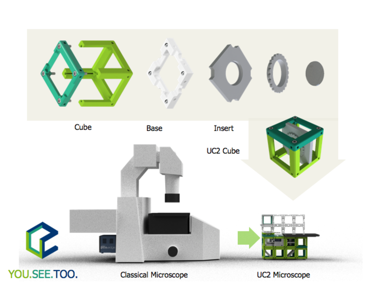
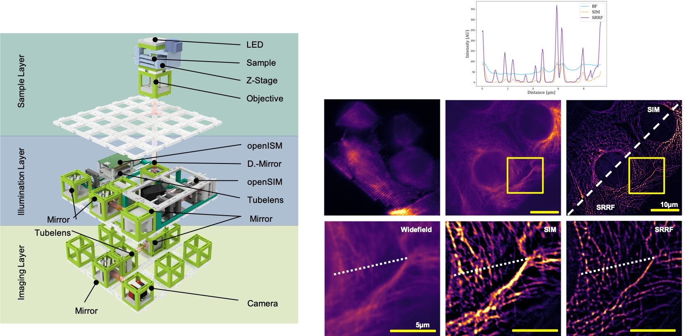
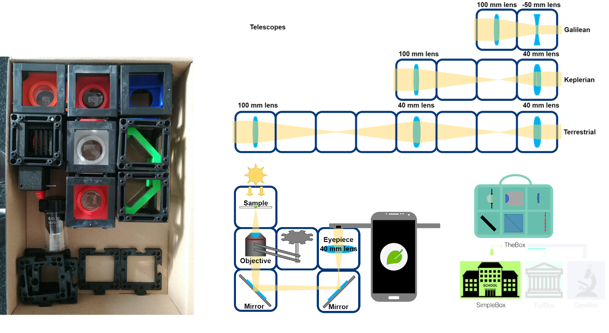
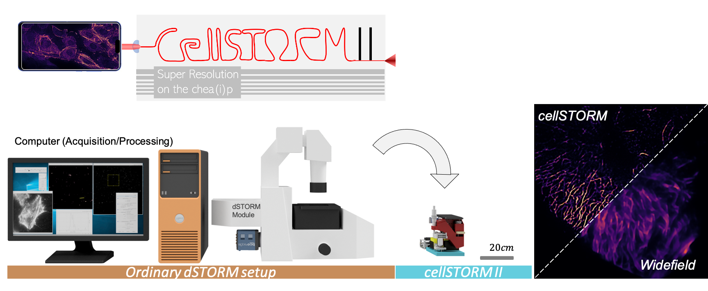
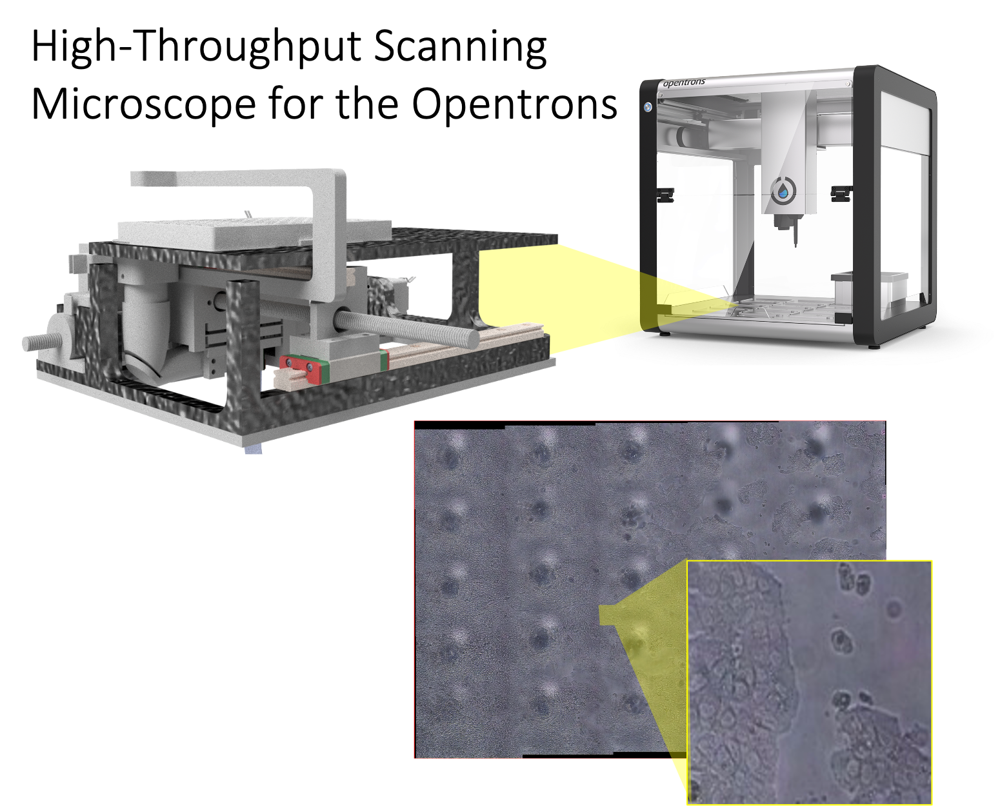

# Suporting Microscpy using Open-Source Hard- and Software Tools

Here you can find a list of our open-source tools to realize all kinds of microscopic imaging. 

## UC2 - A Versatile Optical Toolbox

Open-source optical toolbox for low-end to high-end microscopy. Have an idea? We would be keen to realize it! 

📃[DOI: 10.1038/s41467-020-19447-9](https://doi.org/10.1038/s41467-020-19447-9)

🔬[Github:bionanoimaging/UC2-GIT](https://github.com/bionanoimaging/UC2-GIT/)

🛠[UC2 Online Configurator](https://uc2configurator.netlify.app/)

🎬[Youtube:openUC2](https://www.youtube.com/watch?v=M_oqieogAOo&t=5s&ab_channel=openUC2)

## UC2 - Super-resolution imaging using SIM and ISM

You can perform high-resolution imaging using UC2 using structured illumination microscopy (SIM) and image scanning microscopy (ISM).

📃[DOI: 10.1101/2021.01.08.425840v1](https://www.biorxiv.org/content/10.1101/2021.01.08.425840v1)

🔬[Github:bionanoimaging/UC2-GIT/APPLICATIONS/APP_openSIM](https://github.com/bionanoimaging/UC2-GIT/tree/v3/APPLICATIONS/APP_openSIM)

## UC2 - educationa minBOX

Use UC2 in education? Of course. Made for it using the new injection moulded cubes! All in a curated box with a growing list of optical experiments to challenge peoples creativity.

📃[DOI: 10.1038/s41467-020-19447-9](https://doi.org/10.1038/s41467-020-19447-9)

🔬[Github:bionanoimaging/UC2-GIT/TheBOX](https://github.com/bionanoimaging/UC2-GIT/tree/master/TheBOX)

🎬[Youtube:openUC2](https://www.youtube.com/watch?v=M_oqieogAOo&t=5s&ab_channel=openUC2)

## CellSTORM II

Cellphone-based super-resolution imaging device that realizes **STORM**, **SOFI/SRRF** and live-cell widefield imaging.

📃[DOI: 10.1101/2020.09.04.283085v1](https://www.biorxiv.org/content/10.1101/2020.09.04.283085v1)

🔬[Github:stormocheap](https://beniroquai.github.io/stormocheap/)

## OpenTRONS XY Stage

Multi-well plate reader for the use in pipetting robots to automate large scale micrsocopic imaging experiments.

📃[DOI: N/A (comming soon)]()

🔬[Github:Opentrons-Microscope-Platereader](https://github.com/beniroquai/Opentrons-Microscope-Platereader)

# Contribute

If you have a question or found an error, please file an issue! We are happy to improve the device!  

# License

Please have a look into the dedicated [License file](LICENSE.MD).

# Disclaimer

We do not give any guarantee for the proposed setup. Please use it at your own risk. Keep in mind that Laser source can be very harmful to your eye and your environemnt!
