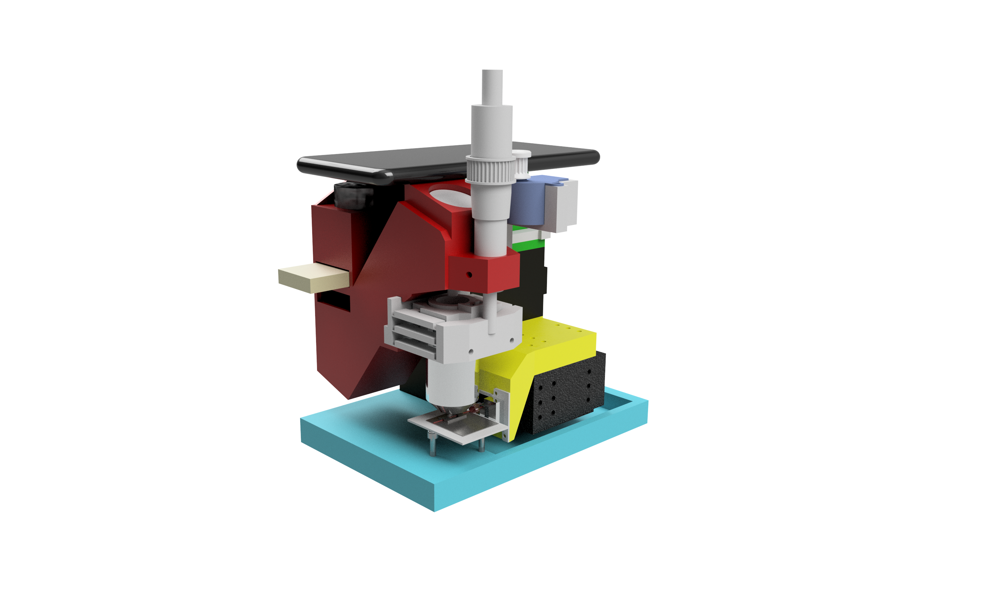
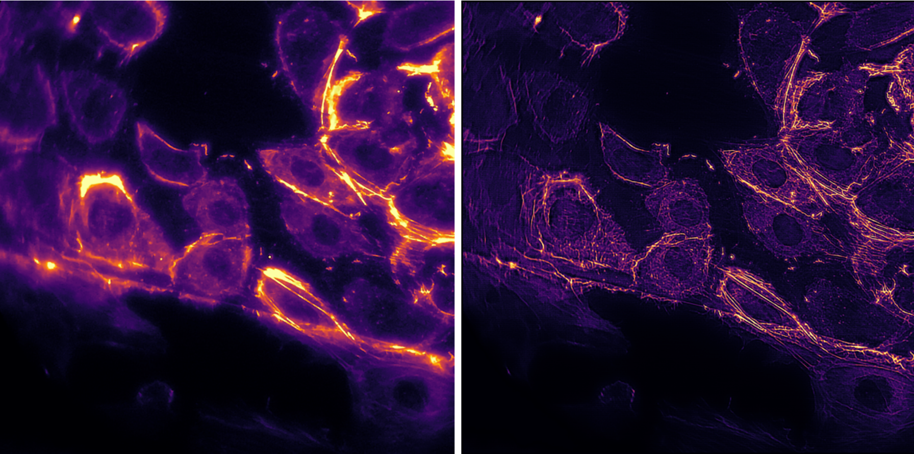
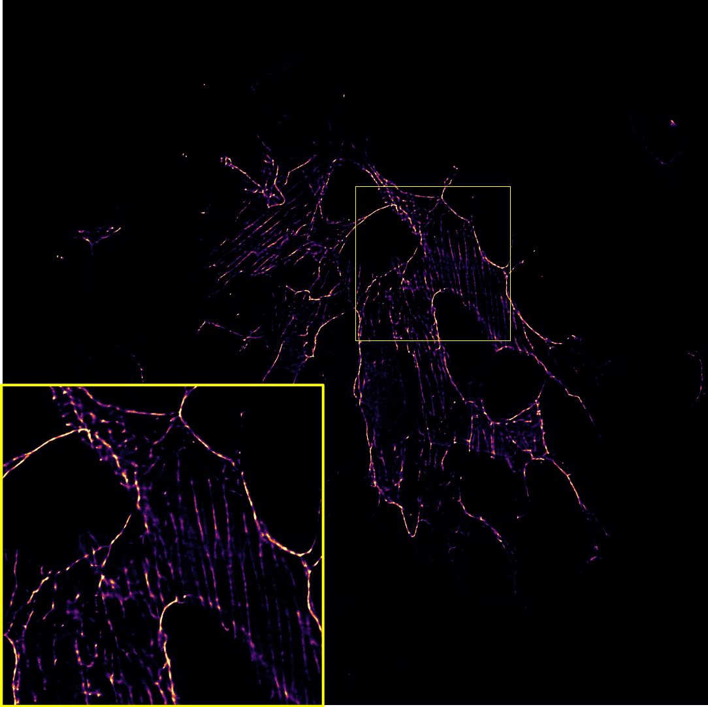
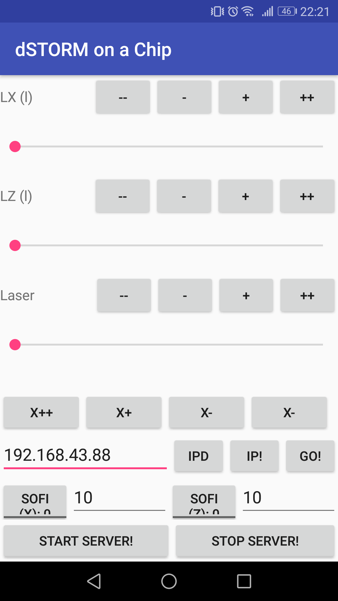
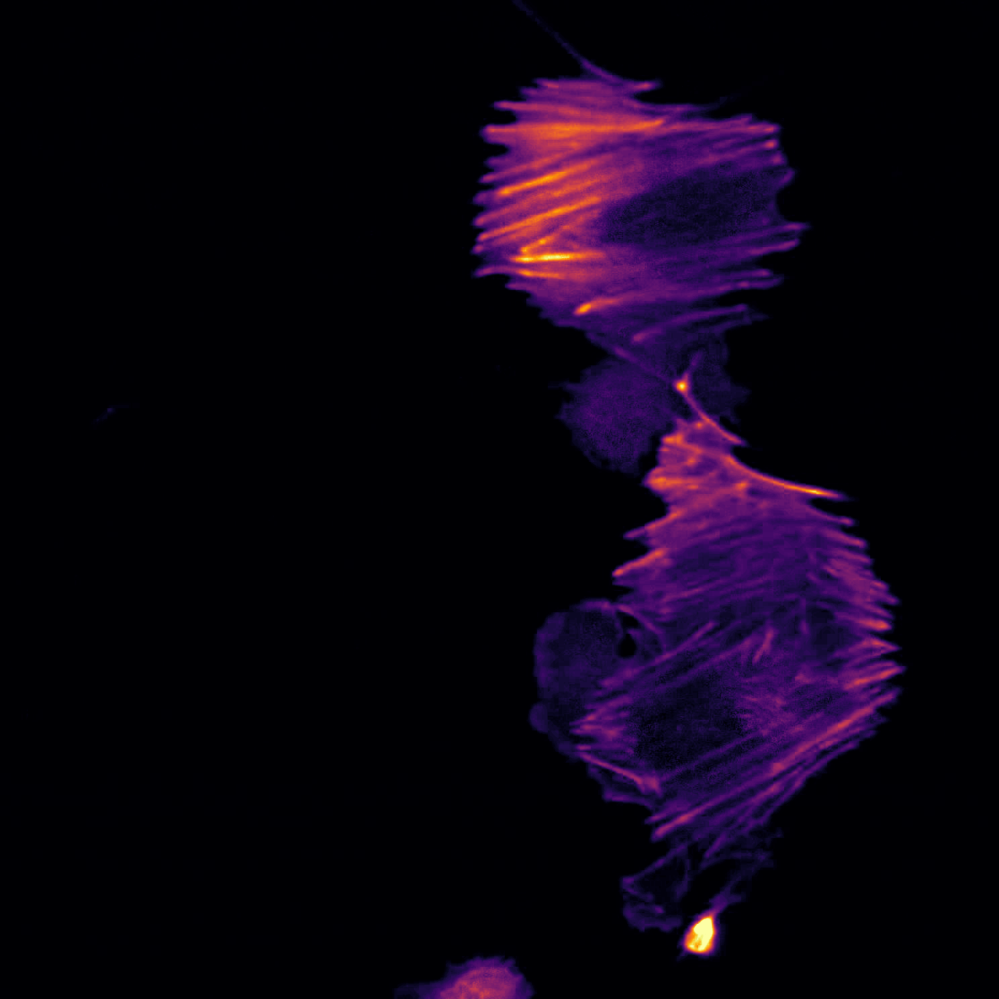
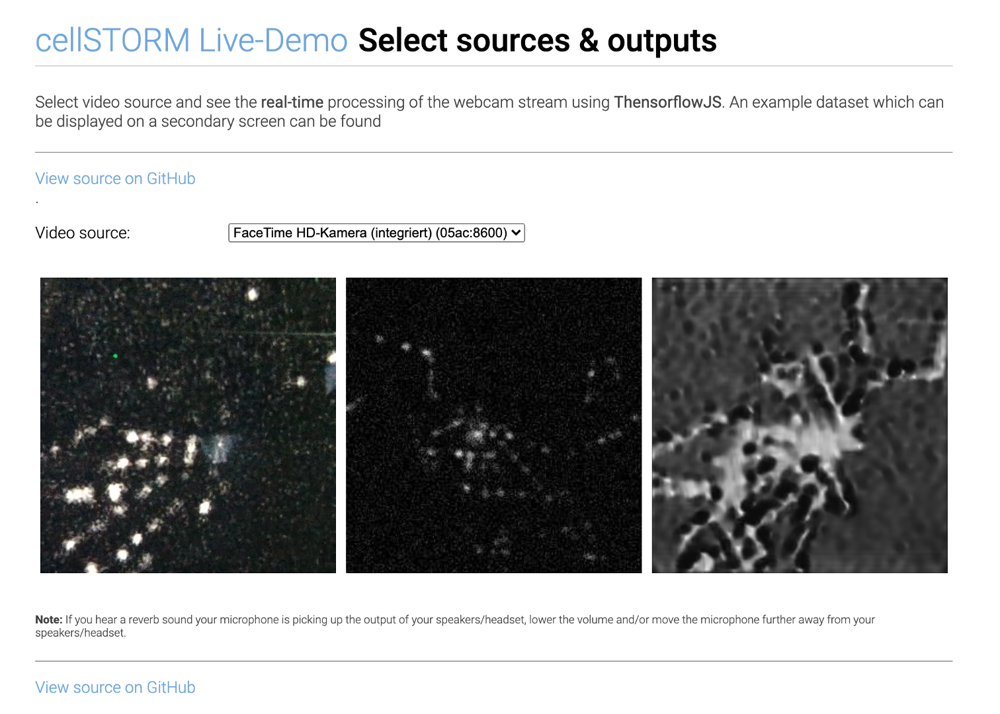
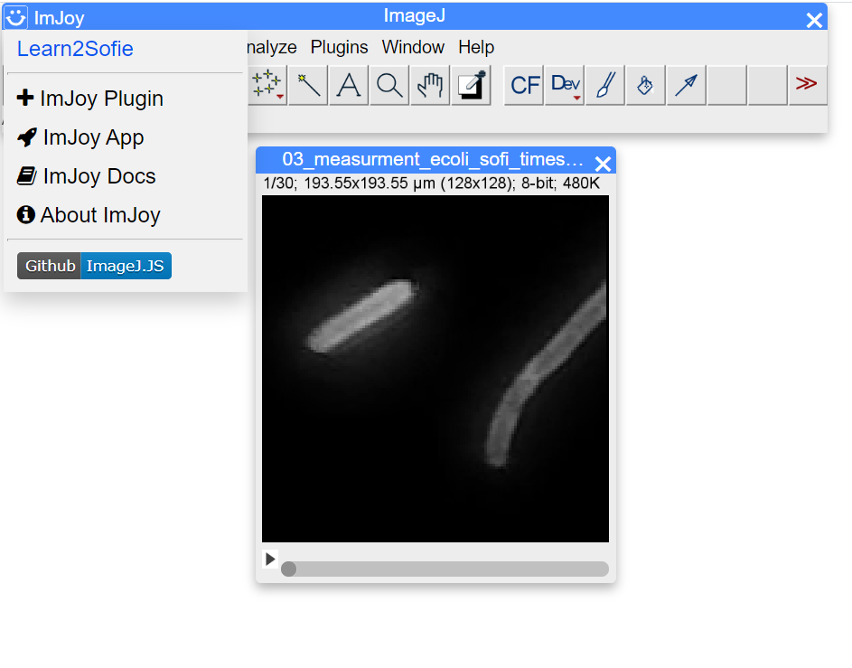
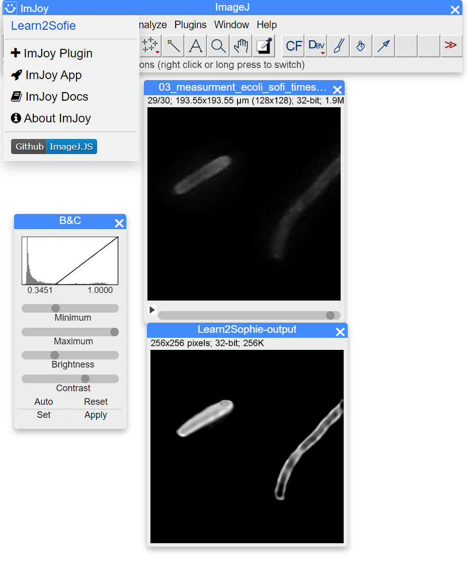

# High throughput for openUC2 - Hi2

A low-cost high-throughput microscope for multi-well plate scanning inside the opentrons pipetting robot.

---

## Preprint

The preprint for the *Hi2* system can be found on [**BIORXIV**]() 😊

Main features:

```
- Large-scale well plate scanning microscope (standalone, UC2-based)
- Open imaging platform for high-throughput experiments
- GRBL-based motor and Laser controler
- OpenFlexure Server-based GUI and control software
- ImJoy-based image processing system (with ImageJ.js)
- Sample protocols to control the OFM microscope with ImJoy and Opentrons
- Long-term experiments with small deviations of the FOV
- Autofocus, scanning, fluorescence microscopy
- costs <1000€ (for single-wavelength imaging)
```


<p align="center">

</p>


# cellSTORM 2

A low-cost super-resolution imaging device based on a cellphone camera and photonic waveguide chips

---

## Preprint

The preprint for the *cell*STORM II device accompanied with a series of applications ca be found on [**BIORXIV**](https://www.biorxiv.org/content/10.1101/2020.09.04.283085v1) 😊

## *cell*STORM II

The compact device features:

```
- autofocus
- automatic coupling mechanism
- on-device superresolution imaging
- survives cell incubators for several days
- performs autonomous imaging over several days
- dSTORM with <100 nm optical resolution
- costs <1000€ (for single-wavelength imaging)
- optical resolution down to 100nm
- multiple wavelength can be used (sequentially)
- using photonic waveguide chips TIRF is possible
```


<p align="center">

</p>


## Super-Resolution using Fluctuating Intensity (SRRF, ESI, SOFI, etc..)

Using SRRF from the Henrique lab it's possible to quickly increase the resolution even without complicated STORM protocols:

<p align="center">

</p>

The image of actin labelled HUVEC cells is acquired using a 60x, 0.85NA objective lens. While moving the coupling lens, the varying intensity pattern caused by a changing mode field pattern can be used to increase the lateral resolution of fluorescently labeled samples at low excitation power. This is suitable for live-cell imaging.

## Super-Resolution using SMLM (*d*STORM)

With high enough coupling efficiency and laser intensity, the setup enables super-resolution with a final resolution <100nm on a large field of view (FOV). This is well suited not only for educational purposes, but also for research outside the ordinary research and optics labs.

<p align="center">

</p>

cellstorm_dstorm_hela_60x.png

# Hardware

## CAD Designs

If you want to replicate the device, you can find a detailed description with all necessary parts to order in this repsitory:

[CAD-Repository](https://github.com/beniroquai/dSTORM-on-a-Chi-ea-p/tree/master/CAD)

## Assembly Tutorials

We now also have a pictures tutorial with a step-by-step guide on how to build the cellSTORM microscope [here](https://github.com/beniroquai/dSTORM-on-a-Chi-ea-p/tree/master/CAD#assembly)


## Electronics and Code

To move the lenses or control the Laser intensity, we relied on Espressife EPS32s. The drawings for the electronic connections as well as the code to control them wirelessly using MQTT can be found here:

[cellSTORM Electronics](https://github.com/beniroquai/dSTORM-on-a-Chi-ea-p/tree/master/ELECTRONICS)

## Bill of Material (BOM)

Along with the 3D printed parts in the Github-repository, you need a set of mechanical, electrical and optical parts summarized in the BOM below:

***Dead Link?***: Ebay is not really a reliable source since resellers may discontinue the product. In case you're looking for a component which can not be found, file an issue [here](https://github.com/beniroquai/dSTORM-on-a-Chi-ea-p/) - alternatively: Copy the name under "Details" and search for it in Ebay. (E.g. "3450 300mW 637nm Dot Laser Module TTL/analog 12VDC" site:laserlands.net) Good luck 🍀

Amazon is more reliable, but personally we try to avoid ordering there (Sorry..). We try to update the list with Amazon links

|  Type | Details  |  Price | Link  |
|---|---|---|---|
| Laser 635/637 nm |  3450 300mW 637nm Dot Laser Module TTL/analog 12VDC |  50 € | [Laserlands](https://www.laserlands.net/diode-laser-module/600nm-640nm-orange-red-laser-module/635dot/200mw-300mw-637nm-638nm-laser-diode-module-ttl-stage-lighting-dj-show-12vdc.html)  |
| Objective Lens | BRESSER DIN-Objektiv 60x, NA 0.85, 160/0.17 |  45 € | [Ebay](https://www.ebay.de/itm/112674628997)  |
| 2x Mirror  | PF10-03-P01	Ø1" Protected Silver Mirror |  50 € | [Thorlabs](https://www.thorlabs.com/thorproduct.cfm?partnumber=PF10-03-P01)  |
| 2x XY-Stages  | XY Axis Manual Trimming Platform Linear Stage Tuning Sliding Table 40/50/60/90mm, 60x60mm |  80 € | [Ebay](https://www.ebay.de/itm/60x60mm-XY-Axis-Trimming-Station-Displacement-Platform-Linear-Stage-Sliding-Tabl/124016151256?hash=item1cdff04ad8:g:MxUAAOSwx3Vd-y2d)  |
| Longpass (640)  |  Chroma 675/50 well suitable for Alexa Fluor 647  |  200-350 € | [Chroma](https://www.ahf.de/en/products/spectral-analysis-photonic/optical-filters/individual-filters/bandpass-filters/600-699-nm/2448/675/50-et-bandpass)  |
| Ocular | MIKROSKOP OKULAR PAAR  PERIPLAN H 10 X  LEITZ WETZLAR GERMANY  |  10-90 € | [Wie-Tec](https://wie-tec.de/Leitz-Mikroskop-Okular-Periplan-GF-10X-mit-festen-Pointer) (Ebay is cheaper, 10x matters!)  |
| ESP32 | ESP32 ESP32S WLAN Dev Kit Board Development Bluetooth Wifi WROOM32 NodeMCU |  7 € | [Amazon](https://www.amazon.de/AZDelivery-NodeMCU-Development-Nachfolgermodell-ESP8266/dp/B071P98VTG/ref=sr_1_1_sspa?dchild=1&keywords=esp32+wroom&qid=1599391362&sr=8-1-spons&psc=1&spLa=ZW5jcnlwdGVkUXVhbGlmaWVyPUExM0FXWE5FVTJFMkpYJmVuY3J5cHRlZElkPUEwMDA0MTA3MlIxS1BPNUpWRlFTNCZlbmNyeXB0ZWRBZElkPUEwNTEwODcyMkszVVFaWFlVOVk1VyZ3aWRnZXROYW1lPXNwX2F0ZiZhY3Rpb249Y2xpY2tSZWRpcmVjdCZkb05vdExvZ0NsaWNrPXRydWU=)  |
| LED Buk driver | 3x SPARKFUN ELECTRONICS INC. COM-13705 |  18 € | [Spparkfun](https://www.tme.eu/en/details/sf-com-13705/other-modules/sparkfun-electronics-inc/com-13705/)  |
| Wires  |  Various |  10 € | [Amazon](https://www.amazon.de/Donau-Elektronik-GMBH-Original-Kupfer/dp/B01BI1G88C/ref=sr_1_5?dchild=1&keywords=kabel+litze&qid=1599391500&sr=8-5)  |
| Powersupply  | 5V, 3A, Various |  10 € | [Amazon](https://www.amazon.de/HomeSpot-Raspberry-Ladeger%C3%A4t-Netzschalter-Kompatibel/dp/B078567K85/ref=sr_1_5?dchild=1&keywords=5V+netzteil+usb+3A&qid=1599391564&sr=8-5)  |
| Raspberry Pi + SD + Powersupply + Housing  | Raspberry Pi 3 Set /Bundle: 16GB SD-Karte, HDMI, original Netzteil und Gehäuse | 70 € | [Amazon](https://www.amazon.de/UCreate-Raspberry-Pi-Desktop-Starter/dp/B07BNPZVR7/ref=sr_1_3?dchild=1&keywords=Raspberry+Pi+set&qid=1599391626&sr=8-3)  |
| Optical Pickup | Objektiv Optik Laser KES-400A PLAYSTATION 3 Nicht Funktioniert für Ersatzteil (**HINT:** Look for KES-400A replacement parts @ Ebay; Sometimes you get 10 pieces for 10€) | 1 € | [ebay](https://www.ebay.de/sch/i.html?_from=R40&_trksid=p2380057.m570.l1313&_nkw=kes400a+&_sacat=0)  |
| PLA filament | Prusament PLA Prusa Galaxy Black 1kg | 25,00 € | [Prusa](https://shop.prusa3d.com/de/prusament/711-prusament-pla-prusa-galaxy-black-1kg.html)  |
| Cellphone+Camera| Huawei P20 Pro 128GB 6GB RAM Single Sim Twilight, TOP Zustand | 300 € | [Amazon](https://www.amazon.de/Huawei-P20-Pro-Dual-General%C3%BCberholt-Schwarz/dp/B07GBD8FQM/ref=sr_1_6?dchild=1&keywords=huawei+p20+pro&qid=1599391774&sr=8-6) |
| Ball Magents | T::A Kugelmagnete 5 6 10 mm N45 Neodym Magnete NdFeB Menge wählbar extrem stark | 10 € | [Amazon](https://www.amazon.de/eLander-Neodym-Super-Magnete-Glas-Magnetboards-Magnettafel-K%C3%BChlschrank/dp/B075V2G73J/ref=sr_1_5?dchild=1&keywords=kugelmagnete+5+mm&qid=1599391804&sr=8-5)  |
| Screws | M3 DIN912 Hex-Key Screws, *HINT:* screws need to be ferro-magnetic (i.e. galvanized!), M3 DIN912 at various lenght may work; we usually have tons of them from the [@openUC2](youseetoo.org)-Project | 10 € | [Amazon](https://www.amazon.de/Zylinder-Innensechskant-Schraube-Vollgewinde-verzinkt/dp/B01MRNRJDZ/ref=sr_1_2_sspa?dchild=1&keywords=m3+schrauben+verzinkt&qid=1599391871&sr=8-2-spons&psc=1&spLa=ZW5jcnlwdGVkUXVhbGlmaWVyPUFHWEMzTTZXM1kzMVUmZW5jcnlwdGVkSWQ9QTA2MTcwNzQzQ1ZHWUs1Rk1QUTRSJmVuY3J5cHRlZEFkSWQ9QTA1OTgyNTNPOU1KSzFaQlVIOEQmd2lkZ2V0TmFtZT1zcF9hdGYmYWN0aW9uPWNsaWNrUmVkaXJlY3QmZG9Ob3RMb2dDbGljaz10cnVl)  |
| Micrometer Screw | RS Electronic 0,1 mm resolution | 40 € | [RS Electronics](https://de.rs-online.com/web/p/mikrometer/7857878/?cm_mmc=DE-PLA-DS3A-_-google-_-PLA_DE_DE_Mess-_und_Pr%C3%BCftechnik_Whoop-_-(DE:Whoop%21)+Mikrometer-_-7857878&matchtype=&pla-342919224201&gclid=Cj0KCQiA962BBhCzARIsAIpWEL0P7-vfA1X5h5AeTN2rp-olhvvnkT95evhjPH9cdIwxzO4EtaosYrkaAvGXEALw_wcB&gclsrc=aw.ds)  |

***ATTENTION:*** In case any parts are missing, please file an issue or contact us! We are happy to help out and to improve 😊


# Software

As the software we relied on three different APPs for recent Android phones (in our case Huawei P20 Pro).

Briefly summarized and in-detail described below:

|  Name | Purpose  |  Source  |
|  STORM-Controler | Remote control (MQTT) to control things like laser intensity, coupling lens, focus  |  [APP: STORM-Controler](https://github.com/beniroquai/dSTORM-on-a-Chi-ea-p/tree/master/ANDROID/STORM-Controller)  |
|  STORM-Imager | Control long-term image acquisition by enabling auto-focus and auto-coupling, schedule fluctuating intensity measurements inside incubators   |   [APP: STORM-Imager](https://github.com/beniroquai/dSTORM-on-a-Chi-ea-p-ANDROID)  |
|  FreeDCam | Full control over the cellphones camera: RAW and video image acquisition |   [FreeDCam](https://github.com/beniroquai/FreeDcam/tree/cellstorm) |
|  ImJoy Fiji.JS Learn2Sofi | Fiji.JS Plugin to process temporal stacks made by Wei @ ImJoy | [](https://ij.imjoy.io/?plugin=https://gist.github.com/oeway/11cc4c3eea5646ec41e0c7a7a1957023&open=https://raw.githubusercontent.com/beniroquai/dSTORM-on-the-chea-i-p-Learn2Fluct/master/TF2_KERAS/testdata/03_measurment_ecoli_sofi_timeseries_txy.tif#) |

## Android APP: STORM-Controler

To control the Lens or Laser using a customized MQTT controler APP, you can visit this repository:

[APP: STORM-Controler](https://github.com/beniroquai/dSTORM-on-a-Chi-ea-p/tree/master/ANDROID/STORM-Controller)

This app allows basic hardware controls:
<p align="center">

</p>

## Android APP: STORM-Imager

This is the APP which can record images, control the device and predict a super-resolved result form the camera live stream. The APP can be found here:

[APP: STORM-Imager](https://github.com/beniroquai/dSTORM-on-a-Chi-ea-p-ANDROID)


### Autofocus inside the APP:

It's just an example how the cellphone maintains the focus. This is done by maximizing the focus metric (i.e. standard deviation over z) as a function of the focus motor position.

<p align="center">

</p>


### SOFI-based superresolution imaging inside the APP:

This is an example of the SOFI-based superresolution imaging using the neural network mentioned below. We used fixed *e.coli* labelled with ATTO 647.
The fluctuation of the illumination is the result of the discrete mode pattern in the singlemode waveguide chip. The input field changes the intensity pattern.   

<p align="center">

</p>

## Android APP: FreeDCam (cellSTORM module)

For the *d*STORM experiments we used the open source APP [FreeDCam](https://github.com/beniroquai/FreeDcam/tree/cellstorm) originally developed and mainted by [killerink](https://github.com/KillerInk/FreeDcam). We provide a modified version for the Huawei P9 and P20 which is used in this work. It enables

1. fast read-out and saving of cropped RAW frames to the SD-cad
2. stream the RAW buffer to a c-server

To stream the data to a server [this manual](https://github.com/beniroquai/FreeDcam/tree/cellstorm/server_mac) gives some more detailed information. It requires Android Studio which compiles the c program into an executable. Inside the APP you need to select the IP of the server.

Many thanks to [@Killerink](https://github.com/KillerInk/) to make this work!

### Settings for FreeDCam (Huawei P20 Pro)

We used the following settings:

***Video Settings:***
<p align="center">

</p>

***General Settings:***
<p align="center">

</p>

<p align="center">

</p>

***Acquisition Settings:***
<p align="center">

</p>


## NN-based Super-Resolution Imaging: "Learn2Fluct"

The python and tensorflow-based neural network to use "SOFI"-like image reconstruction based on ```convLSTM2D``` layers on a cellphone can be found here:

[Neural Network](https://github.com/beniroquai/dSTORM-on-the-chea-i-p-Learn2Fluct)

It aims to transfer a stack of noisy low resolution images with varying illumination pattern:

<p align="center">

</p>

into high resolution images:

<p align="center">

</p>

It is part of the APP "STORM-Imager" and can be used as an interactive website (Live-Demo). To train the model have a look in the recent ```Tensorflow==2.3.0``` implementation using ```Keras```  and ```TFLite``` which can be found in the Github-Reopository [here](https://github.com/beniroquai/dSTORM-on-the-chea-i-p-Learn2Fluct/tree/master/TF2_KERAS).

### Live-Demo using Webcam

We implemented a live-demo of the pre-trained SOFI-network which is available [here](./STORMjs/index.html). It runs in Javascript and does not transfer any (!) data to the internet. It runs locally once the model of the neural network is downloaded.

***Note:*** It's in an experimental stage. It's not optimized for performance. We do not guarantee for proper functionality. Use it on your own risk!

<p align="center">

</p>

The model was tested on a Macbook Pro using a Chrome browser which runs at *~1fps*.


### ImJoy Plugin
[](https://ij.imjoy.io/?plugin=https://gist.github.com/oeway/11cc4c3eea5646ec41e0c7a7a1957023&open=https://raw.githubusercontent.com/beniroquai/dSTORM-on-the-chea-i-p-Learn2Fluct/master/TF2_KERAS/testdata/03_measurment_ecoli_sofi_timeseries_txy.tif#)

Wei made an awesome plugin for the browser-based FiJi which encapsulates the Javascript LiveDemo into a Fiji.JS applet. Very easy to use and beware: No installation necessary!!

Go to the [ImJoy-Plugin Webpage](https://ij.imjoy.io/?plugin=https://gist.github.com/oeway/11cc4c3eea5646ec41e0c7a7a1957023&open=https://raw.githubusercontent.com/beniroquai/dSTORM-on-the-chea-i-p-Learn2Fluct/master/TF2_KERAS/testdata/03_measurment_ecoli_sofi_timeseries_txy.tif#)

It will automatically load a sample TIF-Stack which you can find [here](https://raw.githubusercontent.com/beniroquai/dSTORM-on-the-chea-i-p-Learn2Fluct/master/TF2_KERAS/testdata/03_measurment_ecoli_sofi_timeseries_txy.tif)

***Starting the Plugin:***
Opening the plugin is as easy as selecting it from the ImJoy Icon on the left hand side:
<p align="center">

</p>

***Executing the Plugin:***
Once you hit the Learn2SOFI button it will propagate the image stack through the network which looks like this after processing:
<p align="center">

</p>

You can start playing with your own data by uploading you own time stack. It has to have the following dimensions: ```Nx=128, Ny=128, t=30```

EnJoy! :-)


### Google Colab

[(1) Export Keras model (Tensorflow v2.2!) to Tensorflow Lite (Android)](https://colab.research.google.com/drive/1AkMT-O8qXnH9ikavBGUPaXuKVTPuJ_34?usp=sharing)

[(2) Standalone Keras training and exporting notebook to TFJs and TFLite; (only small dataset, no GPU for training)](https://colab.research.google.com/drive/1_GJKcha7S_J_s0JitunMWd4I2dMx4KC4?usp=sharing)


# Datasets

We provide many datasets in a publicly accessible repository. Please have a look at [ZENODO]() [***Comming Soon - need to wait for all data first***]

***Note:*** Not all the experiments are fully documented. If you need additional experimental parameters, please don't hesitate to get back to us so that we can add this!

# Tutorials

## Video Tutorials to setup the cellSTORM device

### cellSTORM - Part 1: Setup the MQTT server and connect the cellphone
https://www.youtube.com/watch?v=gefJPZ8_ua8&feature=youtu.be

### cellSTORM - Part 2: Align the lens (OPU) and the laser
[https://www.youtube.com/watch?v=GFoVPgfUFtI&feature=youtu.be](https://www.youtube.com/watch?v=GFoVPgfUFtI&feature=youtu.be)

### cellSTORM - Part 3: Adding the waveguide chip and start coupling
[https://www.youtube.com/watch?v=-dWIeXHAiBc&feature=youtu.be](https://www.youtube.com/watch?v=-dWIeXHAiBc&feature=youtu.be)

### cellSTORM - Part 4: Setup the optical part
[https://www.youtube.com/watch?v=qdbaAQTLw-c&feature=youtu.be](https://www.youtube.com/watch?v=qdbaAQTLw-c&feature=youtu.be)

### cellSTORM - Part 5: Setup the imaging using the cellphone
[https://www.youtube.com/watch?v=fhmkS0Ywucg&feature=youtu.be](https://www.youtube.com/watch?v=fhmkS0Ywucg&feature=youtu.be)

### cellSTORM - Part 6: Setup the FreeDCam for best SNR performance
[https://www.youtube.com/watch?v=Evdc-384KZk&feature=youtu.be](https://www.youtube.com/watch?v=Evdc-384KZk&feature=youtu.be)

# Contribute

If you have a question or found an error, please file an issue! We are happy to improve the device!  

# License

Please have a look into the dedicated [License file](LICENSE.MD).

# Disclaimer

We do not give any guarantee for the proposed setup. Please use it at your own risk. Keep in mind that Laser source can be very harmful to your eye and your environemnt!
